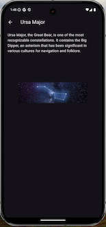
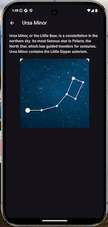
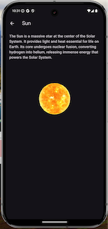
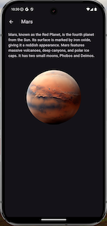

# :stars: Night sky 

A sky map app is a mobile application that provides users with an interactive map of the night sky. It utilizes the device's sensors, such as the GPS, accelerometer, and magnetometer, to determine the user's location and orientation. With this information, the app can display a real-time representation of the stars, planets and constellations visible from the user's location.

## :exclamation: Installation

### Requirements

- **Flutter SDK** - For building and running the app.
- **Dart** - Programming language used by Flutter.
- **IDE** (Android Studio, VS Code, IntelliJ)

### Installation Steps

1. **Clone the Repository:**
```https://github.com/SsandraK/Sky.git```

2. **Install Flutter SDK:**

    Follow the installation guide on the [Flutter website](https://docs.flutter.dev/get-started/install)

3. **Install Dependencies:**
  Run the following command to install the required dependencies:

    ```bash
    flutter pub get
    ```

### Running the Application

1. Connect a physical device or start an emulator.
2. Launch the app by running:

    ```bash
    flutter run
    ```

#### Additional Notes

- Ensure you have the necessary permissions for accessing device location and sensors.
- If you encounter issues, check the output of `flutter doctor` for guidance.


- `Does the app display celestial objects on a black canvas?`
Yes, the app is designed to display celestial objects on a black background (bg_sky.jpeg), which simulates the night sky. The celestial objects (planets, the Sun, the Moon, and constellations) are plotted based on real-time calculations using the device's sensor data (e.g., heading and tilt).

- `Check the current position of the Sun, is it accurate? (use google or a reliable source to know what is the accurate position and compare it to this app)`

Use Google or a reliable astronomy tool like Stellarium Web (`https://stellarium-web.org`) to check the Sun's azimuth and altitude for your location.
Compare these values with the azimuth and altitude displayed for the Sun in the app.
Sun is visiable on the day time. 

- `Are the moon, Mars, and Venus visible in the app?`
Based on your device location the Mars, Moon, Jupiter and Uranus visible on the night time.

- `Are the constellations visible in the app?`
Added constellations are: Ursa Major, Ursa Minor, Lyra and Cassiopeia




  The application uses two **public APIs** to retrieve necessary data for both celestial bodies and constellations. 
  **[JPL Horizons API](https://ssd-api.jpl.nasa.gov/doc/horizons.html)**  Provides precise astronomical data for planetary positions and velocities, based on real-time location and time.
  **[API Ninjas Stars API](https://www.api-ninjas.com/api/stars)** Provides key statistics for thousands of stars discovered in the known universe.

- `Does the app display a short description about the objects such as mass or name?`
When tapping then the app displays short description. 




- `Try moving the phone around, does it change the celestial objects shown on the display?`
Yes, moving the phone should change the displayed celestial objects:
The app uses the phone's sensors (e.g., accelerometer, magnetometer) through the SensorLocation provider.
The celestial positions update based on real-time calculations using the device’s heading and tilt.

The movement can be seen: 
[(https://i.giphy.com/media/v1.Y2lkPTc5MGI3NjExbzY2eWRiZ2t0M2Y0ZmdjMDc0Zm5xcTBkcDd1bW8xaHRnb3A2dnhmMiZlcD12MV9pbnRlcm5hbF9naWZfYnlfaWQmY3Q9Zw/DlF9BUfgWvmKsuyZrF/giphy.gif)]

The application uses the Provider pattern. Provider is a state management solution in Flutter. It allows you to manage and share application state efficiently across widgets without passing data down manually through constructors.
